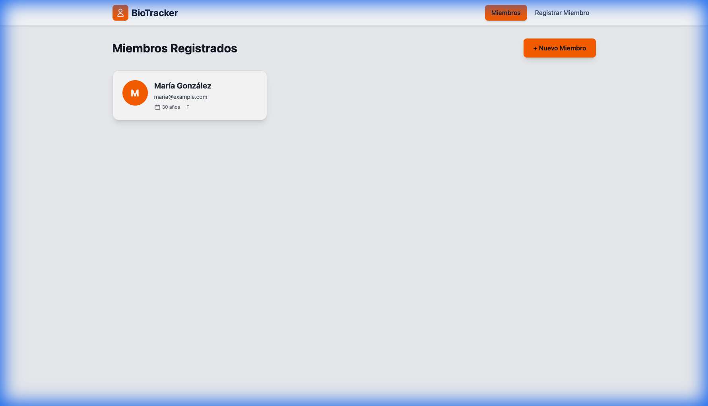
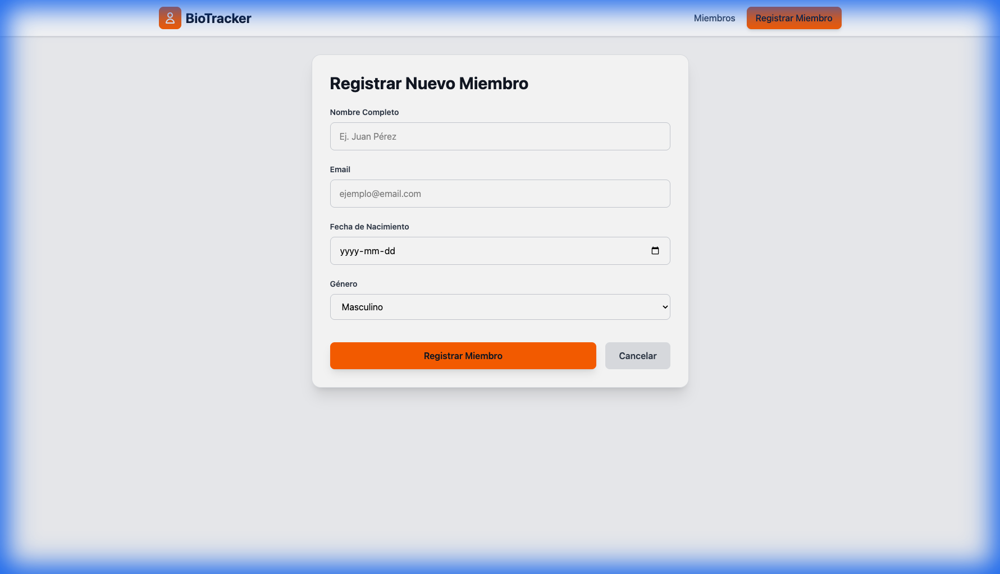
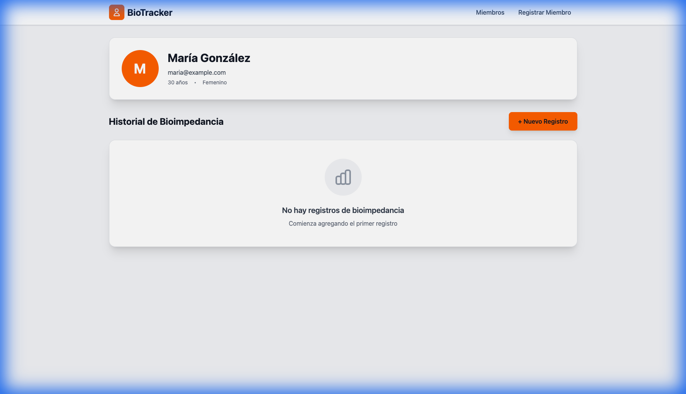
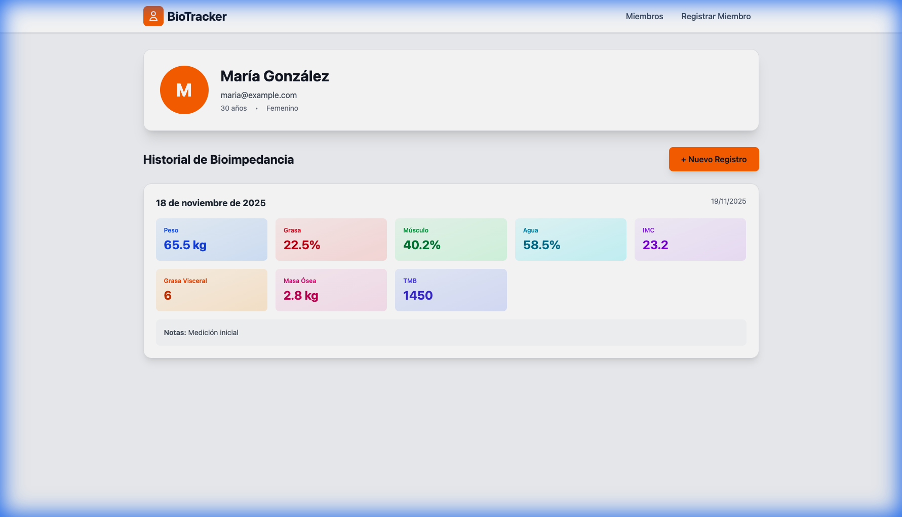

# 🏋️ BioTracker

> Aplicación moderna de registro de miembros y bioimpedancia construida con **React**, **TypeScript**, **Vite** y **Domain-Driven Design (DDD)**.

[](https://choosealicense.com/licenses/mit/)
[](https://www.typescriptlang.org/)
[](https://reactjs.org/)
[](https://tailwindcss.com/)

## 📋 Descripción

BioTracker es una aplicación web para gestionar miembros y llevar un registro detallado de sus mediciones de bioimpedancia (composición corporal). Diseñada con arquitectura DDD para facilitar el mantenimiento, testing y escalabilidad.

### ✨ Características

- ✅ **Registro de miembros** con información personal
- ✅ **Historial de bioimpedancia** con 8 métricas corporales
- ✅ **Persistencia de datos** (localStorage → Supabase)
- ✅ **Arquitectura DDD** limpia y escalable
- ✅ **UI moderna** con Tailwind CSS
- ✅ **Type-safe** con TypeScript
- ✅ **Responsive design** para todos los dispositivos

---

## 🎨 Capturas de Pantalla

### Lista de Miembros


### Formulario de Registro


### Detalles del Miembro


### Historial de Bioimpedancia


---

## 🏗️ Arquitectura

Este proyecto sigue los principios de **Domain-Driven Design (DDD)**:

```
src/
├── domain/              # Entidades y contratos (sin dependencias)
│   ├── entities/        # Member, Bioimpedance
│   └── repositories/    # Interfaces de repositorios
├── infrastructure/      # Implementaciones concretas
│   └── repositories/    # Mock, Supabase
├── application/         # Casos de uso (lógica de negocio)
│   ├── use-cases/       # RegisterMember, RecordBioimpedance...
│   └── di/              # Inyección de dependencias
└── presentation/        # UI (React components)
    ├── components/      # Layout
    └── pages/           # MemberList, MemberDetail...
```

### Ventajas de DDD

- **Separación de responsabilidades**: Cada capa tiene un propósito claro
- **Fácil testing**: Mock de repositorios sin tocar la lógica
- **Migración simple**: Cambiar de localStorage a Supabase sin tocar el dominio
- **Mantenibilidad**: Código organizado y predecible

---

## 🚀 Inicio Rápido

### Prerrequisitos

- Node.js 18+
- npm o yarn

### Instalación

```bash
# Clonar el repositorio
git clone https://github.com/krugerdavid/ng_bio-tracking.git
cd bio-tracker

# Instalar dependencias
npm install

# Iniciar servidor de desarrollo
npm run dev
```

La aplicación estará disponible en `http://localhost:5173`

---

## 📊 Métricas de Bioimpedancia

La aplicación rastrea las siguientes métricas de composición corporal:

| Métrica | Descripción | Unidad |
|---------|-------------|--------|
| **Peso** | Peso corporal total | kg |
| **Grasa Corporal** | Porcentaje de grasa | % |
| **Masa Muscular** | Porcentaje de músculo | % |
| **Agua** | Porcentaje de agua corporal | % |
| **IMC** | Índice de masa corporal | - |
| **Grasa Visceral** | Nivel de grasa interna | 1-59 |
| **Masa Ósea** | Peso de estructura ósea | kg |
| **TMB** | Tasa metabólica basal | kcal/día |

---

## 🗄️ Base de Datos

### Modo Mock (Actual)

Los datos se almacenan en **localStorage** del navegador. Ideal para desarrollo y demos.

### Modo Supabase (Próximamente)

Migración a **Supabase** para persistencia en la nube. Ver [docs/supabase-migration.md](./docs/supabase-migration.md) para el plan completo.

---

## 🛠️ Tecnologías

### Frontend
- **React 18** - Librería UI
- **TypeScript 5** - Type safety
- **Vite 7** - Build tool ultra-rápido
- **React Router 6** - Navegación
- **Tailwind CSS 4** - Estilos utility-first

### Backend (Próximamente)
- **Supabase** - Backend as a Service
- **PostgreSQL** - Base de datos relacional

### DevTools
- **ESLint** - Linting
- **PostCSS** - CSS processing

---

## 📁 Estructura del Proyecto

```
bio-tracker/
├── docs/                   # Documentación
│   ├── screenshots/        # Capturas de pantalla
│   └── supabase-migration.md
├── public/                 # Archivos estáticos
├── src/
│   ├── domain/            # 🟦 Capa de dominio
│   ├── infrastructure/    # 🟨 Capa de infraestructura
│   ├── application/       # 🟩 Capa de aplicación
│   └── presentation/      # 🟪 Capa de presentación
├── index.html
├── package.json
├── tsconfig.json
├── tailwind.config.js
└── vite.config.ts
```

---

## 🧪 Testing

```bash
# Ejecutar tests (próximamente)
npm run test

# Coverage
npm run test:coverage
```

---

## 🚢 Deployment

### Build para Producción

```bash
npm run build
```

Los archivos optimizados se generarán en `dist/`

### Deploy en Vercel/Netlify

1. Conecta tu repositorio
2. Configure build command: `npm run build`
3. Configure output directory: `dist`
4. Deploy! 🎉

---

## 📖 Documentación

- [Plan de Migración a Supabase](./docs/supabase-migration.md)
- [Walkthrough de Implementación](./.gemini/antigravity/brain/3f296880-3e8d-40c8-afa0-7bebfc575c83/walkthrough.md)

---

## 🤝 Contribuir

Las contribuciones son bienvenidas! Por favor:

1. Fork el proyecto
2. Crea una rama (`git checkout -b feature/AmazingFeature`)
3. Commit tus cambios (`git commit -m 'Add: amazing feature'`)
4. Push a la rama (`git push origin feature/AmazingFeature`)
5. Abre un Pull Request

---

## 📝 Roadmap

- [x] ✅ Implementación base con DDD
- [x] ✅ UI con Tailwind CSS
- [x] ✅ Persistencia con localStorage
- [ ] 🔄 Migración a Supabase
- [ ] 📱 Autenticación de usuarios
- [ ] 📊 Gráficas de progreso
- [ ] 📷 Upload de fotos de perfil
- [ ] 📄 Export a PDF
- [ ] 🌐 Internacionalización (i18n)
- [ ] 📱 App móvil (React Native)

---

## 👨‍💻 Autor

**David Kruger**
- GitHub: [@krugerdavid](https://github.com/krugerdavid)
- Proyecto: [ng_bio-tracking](https://github.com/krugerdavid/ng_bio-tracking)

---

## 📄 Licencia

Este proyecto está bajo la licencia MIT. Ver el archivo `LICENSE` para más detalles.

---

## 🙏 Agradecimientos

- Diseño inspirado en las mejores prácticas de DDD
- UI moderna con Tailwind CSS
- Construido con ❤️ usando React y TypeScript

---

**⭐ Si te gusta este proyecto, dale una estrella en GitHub!**
